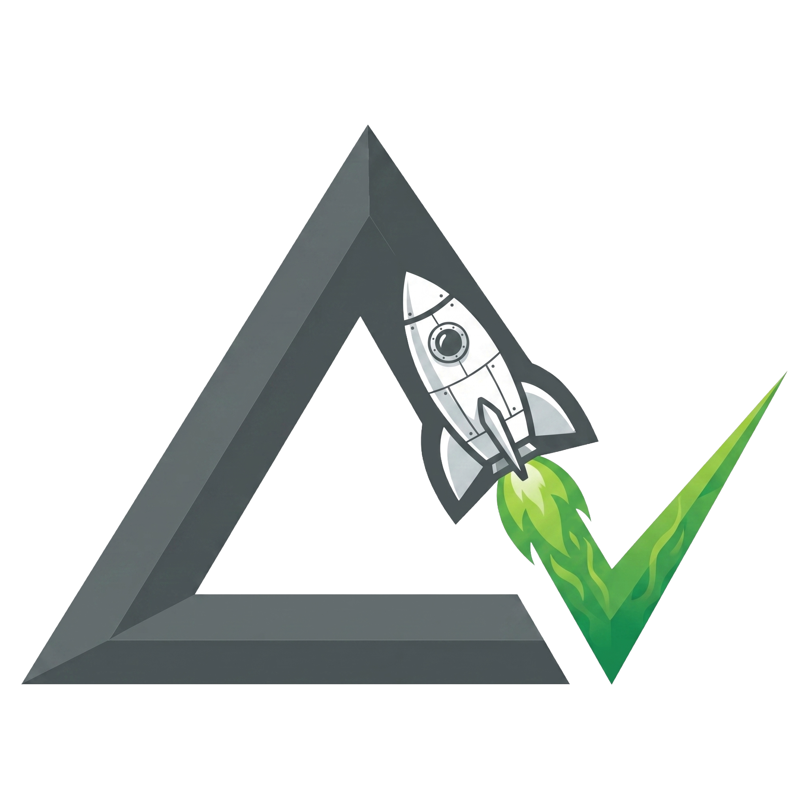

# DeltaV Lab

<p align="center">
  
</p>

<p align="center">
  
  
  
  
  
</p>

## Project Overview

**DeltaV Lab** is an engineering-grade spaceflight simulation tool engineered to bridge the gap between educational rocketry games and professional aerospace analysis software. 

### Why DeltaV Lab?
Traditional orbital mechanics tools can be impenetrable to newcomers, while consumer games often abstract away critical engineering challenges. DeltaV Lab solves this by providing a hyper-realistic, deterministic physics engine wrapped in an accessible browser-based interface. It accurately simulates RK4 integration for orbital mechanics, atmospheric density models, and thermodynamic ablation—allowing users to engineer multi-stage vehicles and test autonomous guidance systems without sacrificing scientific accuracy. 

We chose a strict **TypeScript** architecture coupled with **Web Workers** to guarantee mathematically precise isolation (running fixed time-steps off the main thread) while keeping the frontend responsive and lightning-fast.

---

## Table of Contents
1. [Installation & Requirements](#installation--requirements)
2. [Usage Instructions & Examples](#usage-instructions--examples)
3. [Technologies Used](#technologies-used)
4. [Testing Instructions](#testing-instructions)
5. [Contribution Guidelines](#contribution-guidelines)
6. [License Information](#license-information)

---

## Installation & Requirements

To run this simulation locally, ensure your environment meets the minimum requirements:
- **Node.js**: v18.0.0 or higher
- **Browser**: A modern web browser supporting ES6 modules and Web Workers.

### Setup Instructions

1. **Clone the repository:**
   ```bash
   git clone https://github.com/dhaatrik/professional-rocket-launch-simulation.git
   cd professional-rocket-launch-simulation
   ```

2. **Install dependencies:**
   ```bash
   npm install
   ```

3. **Start the local development server:**
   ```bash
   npm run dev
   ```
   *Note: Under the hood, this relies on a lightweight HTTP server pointing to port 8080.*

4. **Launch the Simulation:**
   Navigate to `http://localhost:8080` in your web browser. 
   *(Optional)* For a dual-screen Mission Control experience, open `http://localhost:8080/telemetry.html` on a second monitor.

---

## Usage Instructions & Examples

DeltaV Lab is split into two primary experiences: Vehicle Assembly and Mission Control.

### 1. Vehicle Assembly (VAB) 🛠️
Build multi-stage rockets using a catalog of engines (Merlin, Raptor, RL-10), fuel tanks, avionics, and fairings. The VAB automatically calculates real-time Delta-V (Δv) and Thrust-to-Weight Ratio (TWR).

### 2. Basic Flight Controls 🎮
| Key | Action |
|-----|--------|
| `SPACE` | **Launch** / **Stage** |
| `Shift` / `Ctrl` | Throttle Up/Down (10% increments) |
| `X` | Cut Engine (Instant 0% throttle) |
| `←` `→` | Steer / Vector Engine |
| `G` | Toggle Autonomous Flight Computer |

*Looking for time-warp, cameras, safety systems, or instructor tools? Check out the complete **[Simulation Controls Guide](simulation_controls.md)**.*

### 3. Programmable Flight Computer (DSL Example) 💻
DeltaV Lab features an autonomous guidance system powered by a custom Domain Specific Language (DSL). You can script your launches for orbital insertions.

**Example: Gravity Turn to Orbit Script**
```text
WHEN ALTITUDE > 1000 THEN PITCH 80
WHEN ALTITUDE > 10000 THEN PITCH 60
WHEN ALTITUDE > 30000 THEN PITCH 45
WHEN APOGEE > 100000 THEN THROTTLE 0
```

*To use this:* Press `F` to open the Script Editor in-game, paste the code, and press `G` prior to liftoff to arm the computer.

---

## Technologies Used

DeltaV Lab is built from the ground up for high-performance and maintainability:

* **TypeScript (v5.3)**: Provides rigorous type safety to prevent catastrophic logic errors in physics mathematical structures.
* **esbuild**: An extremely fast JavaScript bundler utilized for transforming and minifying modules incrementally during development.
* **Web Workers API**: Used to offload the heavy 4th-order Runge-Kutta (RK4) integrations and aerodynamic calculations away from the UI rendering thread.
* **Vitest**: The testing framework of choice for rapid, Vite-native configuration-free unit testing.
* **Vanilla HTML5 Canvas & CSS**: Used for rendering visuals to ensure maximum cross-browser compatibility without bulky UI framework dependencies.

---

## Testing Instructions

We strictly enforce test-driven principles to maintain aerodynamic and physical integrity. To run the automated test suites:

```bash
# Run the standard unit and integration tests
npm run test

# Run tests in continuous watch mode (perfect for development)
npm run test:watch

# Generate a V8-based coverage report
npm run test:coverage
```
*Note: A successful pull request requires passing all Vitest specifications and linting rules.*

---

## Contribution Guidelines

We actively welcome contributions ranging from bug fixes and documentation improvements to new physics modules!

1. Please read our comprehensive [CONTRIBUTING.md](CONTRIBUTING.md) for details on our code of conduct, the reporting process for bugs, and the PR submission pipeline.
2. We ask that all community members adhere to standard Open Source principles—treat all reviewers and users with respect.
3. Be sure to run `npm run lint` and `npm run format` locally before submitting a Pull Request.

---

## License Information

This project is licensed under the **MIT License**.

You are free to use, copy, modify, merge, publish, distribute, sublicense, and/or sell copies of the software. For full legal text, please review the [LICENSE](LICENSE) file.
